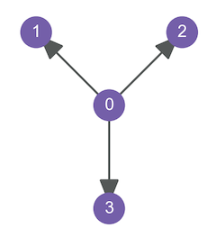
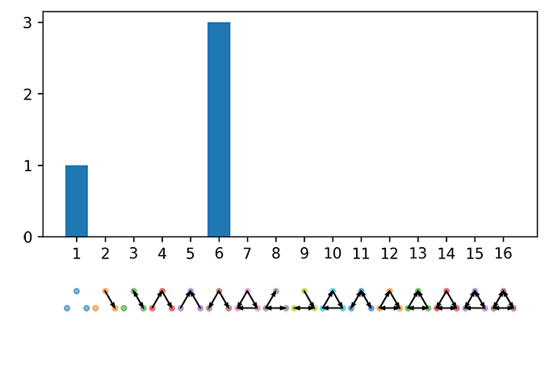

# netsci
Analyzing Complex Networks with Python


|    Author    |                 Version                  |                   Demo                   |
| :----------: | :--------------------------------------: | :--------------------------------------: |
| Gialdetti | [](https://pypi.org/project/netsci/) | [](https://mybinder.org/v2/gh/gialdetti/netsci/master?filepath=examples%2Fnetwork_motifs.ipynb) |


netsci is a python package for efficient statistical analysis of spatially-embedded networks. In addition, it offers efficient implementations of motif counting algorithms.
For other models and metrics, we highly recommend using existing and richer tools. Noteworthy packages are the magnificent [NetworkX](https://networkx.github.io), [graph-tool](https://graph-tool.skewed.de) or [Brain Connectivity Toolbox](https://sites.google.com/site/bctnet/).

## Installing
Install and update using [pip](https://pip.pypa.io/en/stable/quickstart/):
```bash
$ pip install netsci
```

## A simple example
Analyzing a star network (of four nodes)

```python
>>> import numpy as np
>>> import netsci.visualization as nsv
>>> A = np.array([[0,1,1,1], [0,0,0,0], [0,0,0,0], [0,0,0,0]])
>>> nsv.plot_directed_network(A, pos=[[0,0],[-1,1],[1,1],[0,-np.sqrt(2)]])
```



```python
>>> import netsci.metrics.motifs as nsm
>>> f = nsm.motifs(A, algorithm='brute-force')
>>> print(f)
[1 0 0 0 0 3 0 0 0 0 0 0 0 0 0 0]
```

```python
>>> nsv.bar_motifs(f)
```



## Testing
After installation, you can launch the test suite:
```bash
$ pytest
```


## Help and Support

### Examples

|     Theme    |                 MyBinder                  |
| ------------ | :---------------------------------------: |
| Basic network motifs demo | [](https://mybinder.org/v2/gh/gialdetti/netsci/master?filepath=examples%2Fnetwork_motifs.ipynb) |    
| Connectomics dataset, and 3-neuron motif embedding | [](https://mybinder.org/v2/gh/gialdetti/netsci/master?filepath=examples%2Fconnectomics_motif_embedding.ipynb)


### Communication
Please send any questions you might have about the code and/or the algorithm to <eyal.gal@mail.huji.ac.il>.


### Citation
If you use `netsci` in a scientific publication, please consider citing the following paper:

> Gal, E., Perin, R., Markram, H., London, M., and Segev, I. (2019). [Neuron Geometry Underlies a Universal Local Architecture in Neuronal Networks.](https://doi.org/10.1101/656058) BioRxiv 656058.

Bibtex entry:

    @article {Gal2019
        author = {Gal, Eyal and Perin, Rodrigo and Markram, Henry and London, Michael and Segev, Idan},
        title = {Neuron Geometry Underlies a Universal Local Architecture in Neuronal Networks},
        year = {2019},
        doi = {10.1101/656058},
        journal = {bioRxiv}
    }
