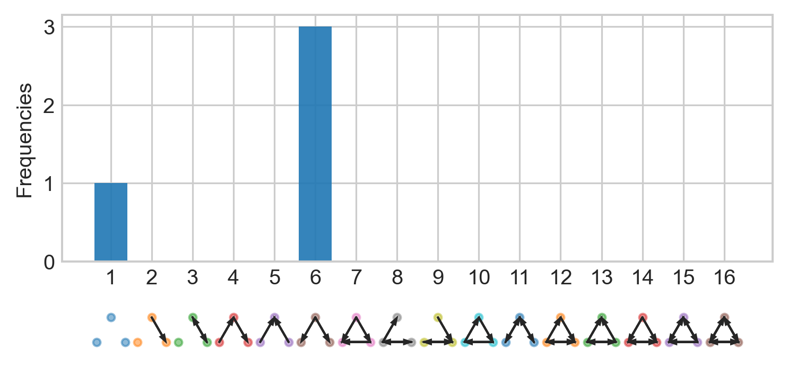

# netsci
Analyzing Complex Networks with Python


|  Author   |                                        Version                                        |                                                                     Demo                                                                      |
| :-------: | :-----------------------------------------------------------------------------------: | :-------------------------------------------------------------------------------------------------------------------------------------------: |
| Gialdetti | [](https://pypi.org/project/netsci/) | [](https://mybinder.org/v2/gh/gialdetti/netsci/master?filepath=examples%2Fnetwork_motifs.ipynb) |


`netsci` is a python package for efficient statistical analysis of spatially-embedded networks. In addition, it offers several algorithms and implementations (CPU and GPU-based) of motif counting algorithms.

For other models and metrics, we highly recommend using existing and richer tools. Noteworthy packages are the magnificent [NetworkX](https://networkx.github.io), [graph-tool](https://graph-tool.skewed.de) or [Brain Connectivity Toolbox](https://sites.google.com/site/bctnet/).


## A simple example
Analyzing a star network (of four nodes)

```python
import numpy as np
import netsci.visualization as nsv

A = np.array([[0,1,1,1], [0,0,0,0], [0,0,0,0], [0,0,0,0]])
nsv.plot_directed_network(A, pos=[[0,0],[-1,1],[1,1],[0,-np.sqrt(2)]])
```


```python
import netsci.metrics.motifs as nsm
f = nsm.motifs(A, algorithm='brute-force')
print(f)
# [1 0 0 0 0 3 0 0 0 0 0 0 0 0 0 0]
```

```python
nsv.bar_motifs(f)
```


Using GPU for the motif counting is easy
```python
from netsci.models.random import erdos_renyi

A_er = erdos_renyi(n=1000, p=0.01, random_state=71070)    # Create an Erdős–Rényi network
f_er = nsm.motifs(A_er, algorithm='gpu')                  # Count motifs using a GPU

print(f_er)
# [156453141   9481653     37283     95997     47667     48287      1001       843
#        769       334         2         9         5         9         0         0]
```

## Installation
### Install latest release version via [pip](https://pip.pypa.io/en/stable/quickstart/)
```bash
$ pip install netsci
```

### Install latest development version
via pip
```bash
$ pip install git+https://github.com/gialdetti/netsci.git
``` 
or in development mode
```bash
$ git clone https://github.com/gialdetti/netsci.git
$ cd netsci
$ pip install -e .
```

## Testing
After installation, you can launch the test suite:
```bash
$ pytest
```


## Help and Support

### Examples

| Theme                                                                                                                                                      |                                                                          MyBinder                                                                           |                                                                                              Colab                                                                                              |
| ---------------------------------------------------------------------------------------------------------------------------------------------------------- | :---------------------------------------------------------------------------------------------------------------------------------------------------------: | :---------------------------------------------------------------------------------------------------------------------------------------------------------------------------------------------: |
| [Basic network motifs demo](https://nbviewer.org/github/gialdetti/netsci/blob/master/examples/network_motifs.ipynb)                                        |        [](https://mybinder.org/v2/gh/gialdetti/netsci/master?filepath=examples%2Fnetwork_motifs.ipynb)        |                                                                                                                                                                                                 |
| [Connectomics dataset, and 3-neuron motif embedding](https://nbviewer.org/github/gialdetti/netsci/blob/master/examples/connectomics_motif_embedding.ipynb) | [](https://mybinder.org/v2/gh/gialdetti/netsci/master?filepath=examples%2Fconnectomics_motif_embedding.ipynb) | [](https://colab.research.google.com/github/gialdetti/netsci/blob/master/examples/connectomics_motif_embedding.ipynb) |


### Communication
Please send any questions you might have about the code and/or the algorithm to <eyal.gal@mail.huji.ac.il>.


### Citation
If you use `netsci` in a scientific publication, please consider citing the following paper:

> Gal, E., Perin, R., Markram, H., London, M., and Segev, I. (2019). [Neuron Geometry Underlies a Universal Local Architecture in Neuronal Networks.](https://doi.org/10.1101/656058) BioRxiv 656058.

Bibtex entry:

    @article {Gal2019
        author = {Gal, Eyal and Perin, Rodrigo and Markram, Henry and London, Michael and Segev, Idan},
        title = {Neuron Geometry Underlies a Universal Local Architecture in Neuronal Networks},
        year = {2019},
        doi = {10.1101/656058},
        journal = {bioRxiv}
    }
